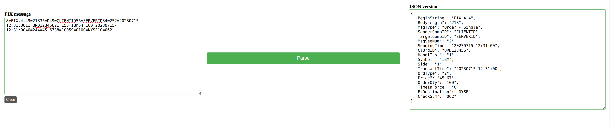

# Description
Simple nim application to convert a FIX message to json



To build & run the application:
```
nimble build
main
```

To run the server:
```
nim js -d:release src/templates/index.nim
nim c -r src/server.nim
```

To run the tests:
```
nimble test
```
